# NLFFF-3D-Dataset
## **太阳活动区非线性无力场3D数据集** 

在线文档：https://nlfff-3d-dataset.readthedocs.io/zh_CN/latest/

太阳活动区非线性无力场3D数据集，使用改写[Thomas Wiegelmann](mailto:wiegelmann@mps.mpg.de)的LINFF(An IDL-widget program for force-free coronal magnetic fields.)程序，对2010到2019年[HMI活动区补丁矢量场数据](http://jsoc.stanford.edu/ajax/lookdata.html?ds=hmi.sharp_cea_720s)进行抽样预处理和计算。

整个处理流程如下：



2010到2019年的HMI原始数据抽样细节将在**原始数据及抽样**部分进行介绍。程序改写内容包括，改写由IDL语言编写预处理等部分代码，需要配置自定义参数部分的代码，改写细节将在后面**数据预处理及计算**部分进行介绍。产品数据及使用方法可以在**产品数据及使用**和**工具包**部分查看；数据使用和合作申请详见**数据支持**，基于该数据库的相关成果和合作详见**成果与引用**。

## 2022第一批计算信息

### 计算机器

| 2022年第一批计算信息 |                       |
| -------------------- | --------------------- |
| 数据时间跨度         | 2010-2019             |
| 数据计算跨度         | 2021.12.10-2022.03.19 |
| 数据总存储量         | ~160T                 |
| 数据磁图总量         | ~73000                |
|                      |                       |

### 目录结构

```

nlfff-data-2022                 # 大约73000张
├── grid1.done                  # 最多跑到第1层，且第1层是质量通过的
│   ├── grid1.done.duh.log      # du -h . 产生的log
│   ├── grid1.done.du.log       # du . 产生的log
│   ├── grid1.done.treeL1.log   # tree L 1 . 产生的log
│   ├── grid1.done.tree.log     # tree . 产生的log
│   ├── hmi.sharp_cea_720s.1126.20111205_000000_TAI
│   │   ├── Bout.bin            # Bout.bin 数据
│   │   ├── grid1.ini           # 和Bout.bin数据尺寸一致
│   │   ├── NLFFFquality1.log   # 质量通过
│   │   ├── run.log             # 运行日志
│   │   └── ...
│   ├── hmi.sharp_cea_720s.1126.20111205_142400_TAI
│   └── ...
├── grid1.qfail                 # 最多跑到第1层，但第1层是质量未通过
│   ├── grid1.qfail.duh.log
│   ├── grid1.qfail.du.log
│   ├── grid1.qfail.treeL1.log
│   ├── grid1.qfail.tree.log
│   ├── hmi.sharp_cea_720s.1126.20111205_000000_TAI
│   │   ├── Bout.bin            # Bout.bin 数据
│   │   ├── grid1.ini           # 和Bout.bin数据尺寸一致
│   │   ├── NLFFFquality1.log   # 质量未通过
│   │   ├── run.log
│   │   └── ...
│   ├── hmi.sharp_cea_720s.1126.20111205_142400_TAI
│   └── ...
├── grid2.done                  # 最多跑到第2层，且第2层是质量通过的 大约15000张
│   ├── grid2.done.duh.log
│   ├── grid2.done.du.log
│   ├── grid2.done.treeL1.log
│   ├── grid2.done.tree.log
│   ├── hmi.sharp_cea_720s.1126.20111205_000000_TAI
│   │   ├── Bout.bin            # Bout.bin 数据
│   │   ├── grid2.ini           # 和Bout.bin数据尺寸一致
│   │   ├── NLFFFquality1.log   # 质量通过
│   │   ├── NLFFFquality2.log   # 质量通过
│   │   ├── run.log
│   │   └── ...
│   ├── hmi.sharp_cea_720s.1126.20111205_142400_TAI
│   └── ...
├── grid2.qfail                 # 最多跑到第2层，但第2层是质量未通过
│   ├── grid2.qfail.duh.log
│   ├── grid2.qfail.du.log
│   ├── grid2.qfail.treeL1.log
│   ├── grid2.qfail.tree.log
│   ├── hmi.sharp_cea_720s.1126.20111205_000000_TAI
│   │   ├── Bout.bin            # Bout.bin 数据
│   │   ├── grid2.ini           # 和Bout.bin数据尺寸一致
│   │   ├── NLFFFquality1.log   # 质量通过
│   │   ├── NLFFFquality2.log   # 质量未通过
│   │   ├── run.log
│   │   └── ...
│   ├── hmi.sharp_cea_720s.1126.20111205_142400_TAI
│   └── ...
├── grid3.done                          # 最多跑到第3层，且第3层是质量通过的  大约58000张
│   ├── grid3.done.duh.log
│   ├── grid3.done.du.log
│   ├── grid3.done.treeL2.log
│   ├── grid3.done.tree.log
│   ├── grid3.done.Bout.sha256sum.log   # sha256sum Bout.bin 的日志
│   ├── num_0000_0099
│   ├── num_0100_0199
│   ├── num_1100_1199                   # sharpnum 所属的序号范围
│   │   ├── hmi.sharp_cea_720s.1126.20111205_000000_TAI
│   │   │   ├── Bout.bin                # Bout.bin 数据
│   │   │   ├── grid3.ini               # 和Bout.bin数据尺寸一致
│   │   │   ├── NLFFFquality1.log       # 质量通过
│   │   │   ├── NLFFFquality2.log       # 质量通过
│   │   │   ├── NLFFFquality3.log       # 质量通过
│   │   │   ├── run.log
│   │   │   └── ...
│   │   ├── hmi.sharp_cea_720s.1126.20111205_142400_TAI
│   │   └── ...
│   └── ...
└── B0
```

