# 数据预处理及计算

数据处理需要经过预处理和三重网格计算两个步骤。



## 原始数据及抽样

原始数据基于[drms](https://docs.sunpy.org/projects/drms/en/stable/)工具包下载[HMI活动区补丁矢量场数据](http://jsoc.stanford.edu/ajax/lookdata.html?ds=hmi.sharp_cea_720s)，抽样规则如下：

| 2022年第一批计算信息 |               |
| -------------------- | ------------- |
| 时间范围             | 2010年-2019年 |
| 活动区序号范围       | 1-7400        |
| 时间间隔             | 96分钟        |
| 数据类型             | Bp，Bt，Br    |
| TODO其他规则         |               |

例子
```
hmi.sharp_cea_720s.4225.20140617_142400_TAI.Bp.fits
hmi.sharp_cea_720s.4225.20140617_142400_TAI.Bt.fits
hmi.sharp_cea_720s.4225.20140617_142400_TAI.Br.fits
```

## 预处理

### 整体流程

整体流程如下，将Bp，Bt，Br计算变为allboundaries，mask，grid和boundary


### 流程细节

具体预处理流程如下，三重网格需要Nx，Ny，Nz是4的倍数，这样后面除以两次2才能保证是整数。


涉及自定义参数的部分如下：

+ 1.裁剪为4的倍数的算法
+ 2.计算Nz的算法
+ 3.产生mask的算法
+ 4.rebin的算法
+ 5.boundary的值
+ 6.grid缓冲区值

详细阐述如下：

1.裁剪为4倍数的算法

+ 若从fits读取的二维数组维度Nx，Ny就是4的倍数则不做处理；
+ 若不是4的倍数，则做**裁剪**，裁剪方法如下
  + 以Nx为例子
    + 原来Nx是从下标为0开始到Nx，
    + 现在变为下标从1开始
      + 若仍然不是4的倍数
      + 则尾部减去再减去1-2个数
    + 如：len(Nxraw)=9[0:8],Nxnew=8[1:8]
    + len(Nxraw)=14[0:13],Nxnew=8[1:12]

2.计算Nz的算法

为$\frac{3(Nx+Ny)}{8}$，其中Nx，Ny是经过对齐4后的值，若得到的Nz值不是4的倍数，则加1-3凑成4的倍数。

3.产生mask的算法

为`B_T/max(B_T)`，即$\frac{\sqrt{\mathbf N_x^2+\mathbf N_y^2}}{max(\sqrt{\mathbf N_x^2+\mathbf N_y^2})}$

4.rebin的算法

为取4个方格点的值求和再除以4平均

5.boundary的值

固定如下
```
nue
	0.001
boundary
	0
Mask B_T/max(B_T)

```

6.grid缓冲区值

固定如下
```
mu
	0.1
nd
	0
```


## 计算

### 整体流程

总体流程如下，使用预处理产生的文件进行三重网格计算，产生Bout.bin


### 流程细节

先进行第一重网格(即最小网格)计算，然后质量控制，然后第二第三重，最终产生Bout.bin文件为非线性无力场3D数据，中间产生B0.bin为势场文件，因为存储问题，最后没有全部保存，做了进一步抽样，详见**产品数据及使用**。


涉及自定义参数的部分如下：

+ 1.质量通过的标准
+ 2.计算平台的硬件信息

详细阐述如下：

1.质量通过的标准

`Angle(B,J)`角度小于30度，如：

```

 Quality Check of NLFFF field
 Input File: Bout.bin  

 Full Box, nx=424, ny=1112,nz=580, nd=0 

 Average B on lower Boundary: 106.44
 L=76.3422, L1=48.8366,  L2= 27.5056
 Sigma_J 0.2908 , Angle(B,J) = 16.9053 Degree
 -------------------------------------------------------------------

 Inner Region, nx=424, ny=1112,nz=580 

 Average B on lower Boundary: 106.44
 L=76.3422, L1=48.8366,  L2= 27.5056
 Sigma_J 0.2908 , Angle(B,J) = 16.9053 Degree
 -------------------------------------------------------------------
```

2.计算平台的硬件信息

因为保存数据为二进制文件，存储涉及float的位数及大小端对齐问题，详细信息如下：

2022年第一批计算信息

| 平台                                           | 架构  | float位数 | 大小端        |
| ---------------------------------------------- | ----- | --------- | ------------- |
| [鹏城云脑计算](https://cloudbrain2.pcl.ac.cn/) | arm64 | 8byte     | Little Endian |
| [鹏城盘古计算](https://cloudbrain2.pcl.ac.cn/) | arm64 | 8byte     | Little Endian |
| [科技云计算](https://www.blsc.cn/)             | x86   | 8byte     | Little Endian |


