# 产品数据及使用

## 原始数据

### Bp.fits

http://jsoc.stanford.edu/doc/data/hmi/sharp/sharp.htm

### Bt.fits

http://jsoc.stanford.edu/doc/data/hmi/sharp/sharp.htm

### Br.fits

http://jsoc.stanford.edu/doc/data/hmi/sharp/sharp.htm

## 预处理数据文件

### grid.ini

| 参数     | 信息                                                         |
| -------- | ------------------------------------------------------------ |
| 是否保存 | 全部保存                                                     |
| 具体包括 | grid1.ini，grid2.ini，grid3.ini                              |
| 文件含义 | 存储二维的nx，ny边界大小； 存储nz想要计算高度的大小，其中nx，ny，nz为同一比例尺； nd存储缓冲区大小； mu无实际意义，兼容以前版本 |

### allboundaries.dat

| 参数     | 信息                                                       |
| -------- | ---------------------------------------------------------- |
| 是否保存 | 全部保存                                                   |
| 具体包括 | allboundaries1.dat，allboundaries2.dat，allboundaries3.dat |
| 文件含义 | 转换存储fits二维的Bp，Bt，Br二维数据                       |

### mask.dat

| 参数     | 信息                            |
| -------- | ------------------------------- |
| 是否保存 | 全部保存                        |
| 具体包括 | mask1.dat，mask2.dat，mask3.dat |
| 文件含义 | 存储计算需要的error mask        |

### boundary.ini

| 参数     | 信息                               |
| -------- | ---------------------------------- |
| 是否保存 | 全部保存                           |
| 具体包括 | boundary.ini                       |
| 文件含义 | 存储计算需要的error mask等基本信息 |

## 产品数据文件

### Bout.bin

| 参数     | 信息                                                         |
| -------- | ------------------------------------------------------------ |
| 是否保存 | 全部保存                                                     |
| 具体包括 | Bout.bin                                                     |
| 文件含义 | 非线性无力场3D数据，其nx，ny，nz尺寸与gridx.ini一致，x取1，2或3取决于该数据最后跑到第几层 |

#### 数据格式

##### 理解角度

##### 存储角度

整体是一个`3*nx*ny*nz`的浮点二进制数组，与c语言数组存储方式一致，即nz变化最快。

### B0.bin

| 参数     | 信息       |
| -------- | ---------- |
| 是否保存 | 部分保存   |
| 具体包括 | B0.bin     |
| 文件含义 | 势场3D数据 |

### run.log

| 参数     | 信息                                                 |
| -------- | ---------------------------------------------------- |
| 是否保存 | 全部保存                                             |
| 具体包括 | run.log                                              |
| 文件含义 | 运行日志，包含运行平台、计算数据、算法输出日志等信息 |

### NLFFFquality.log

| 参数     | 信息                                                    |
| -------- | ------------------------------------------------------- |
| 是否保存 | 全部保存                                                |
| 具体包括 | NLFFFquality1.log、NLFFFquality2.log、NLFFFquality3.log |
| 文件含义 | 数据质量                                                |

### Energy.log

| 参数     | 信息       |
| -------- | ---------- |
| 是否保存 | 全部保存   |
| 具体包括 | Energy.log |
| 文件含义 | TODO       |

### prot.log

| 参数     | 信息                            |
| -------- | ------------------------------- |
| 是否保存 | 全部保存                        |
| 具体包括 | prot1.log、prot2.log、prot3.log |
| 文件含义 | TODO                            |

### step.log

| 参数     | 信息                            |
| -------- | ------------------------------- |
| 是否保存 | 全部保存                        |
| 具体包括 | step1.log、step2.log、step3.log |
| 文件含义 | TODO                            |

### zboundaries2n2.dat

| 参数     | 信息               |
| -------- | ------------------ |
| 是否保存 | 全部保存           |
| 具体包括 | zboundaries2n2.dat |
| 文件含义 | TODO               |

